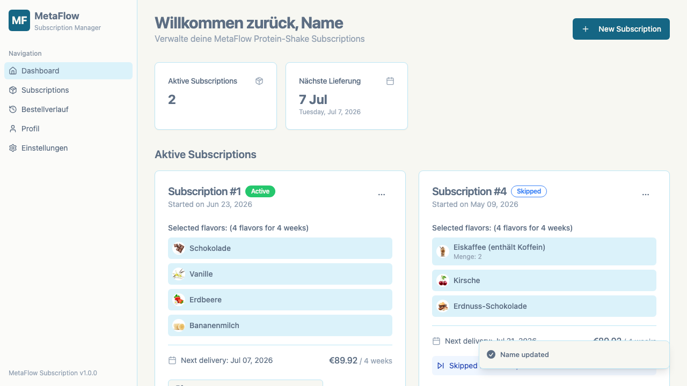
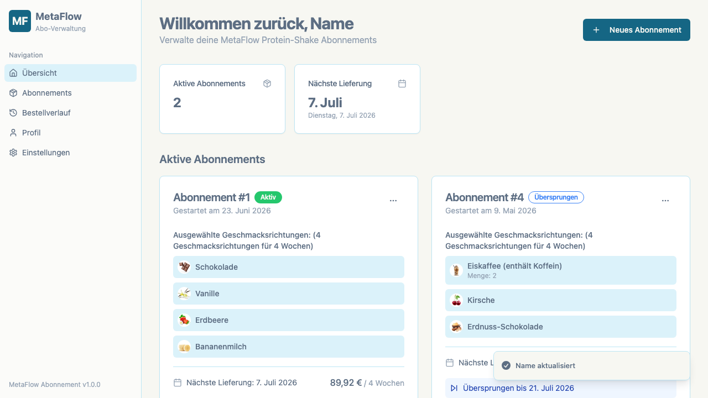

# StayAI German Translation Layer


Dieses Projekt löst die Übersetzungs- und Formatierungsaufgabe aus der StayAI Case Study. Das Skript ergänzt eine fremde React-Anwendung um deutsche UI-Texte sowie deutsche Datums-, Zeit- und Währungsformate, ohne den Quellcode der Anwendung zu verändern.

Da weder Quellcodezugriff noch Translation Keys verfügbar sind, arbeitet die Lösung auf DOM-Ebene und berücksichtigt dynamisches React-Rendering sowie verteilte Textknoten.

## Schnellstart

### Vorher und nachher

| Ohne Übersetzungsskript | Mit `stayai-de.js` |
| --- | --- |
|  |  |

1. [Test-Webseite](https://metaflow-x-casestudy.lovable.app/?name=Name) öffnen.
2. Die Browser-Entwicklertools öffnen und zur Konsole wechseln.
3. Den gesamten Inhalt von `stayai-de.js` einfügen und ausführen.
4. Zwischen den Seiten navigieren und Dialoge öffnen.

Die Übersetzung bleibt bei React-Seitenwechseln und dynamisch geladenen Dialogen aktiv.

## Abgedeckte Fälle

- statische und dynamische UI-Texte auf allen Hauptseiten
- React-Texte, die auf mehrere Textknoten verteilt sind
- englische Datumsangaben, Monatsnamen und 12-Stunden-Zeiten
- React Day Picker mit deutschen Monaten, Wochentagen und Navigationslabels
- Eurobeträge in englischen und deutschen Ausgangsformaten
- getrennte React-Knoten für Währungssymbol und Betrag
- Sonner-Snackbars für Pausieren, Fortsetzen und Überspringen
- Snackbars, deren dynamischer Satz auf mehrere React-Textknoten verteilt ist
- deutsche Anzeige von Lieferadresse und Land im Profil
- `aria-label`, `alt`, `placeholder` und `title`

## Konsolen-API

Nach dem Start steht `window.StayAIDe` zur Verfügung:

```js
StayAIDe.refresh();
StayAIDe.translateText("Jul 6, 2026 at 3:30 PM - EUR 89.92");
StayAIDe.stop();
```

Die Beispielübersetzung ergibt `6. Juli 2026 um 15:30 Uhr - 89,92 €`.

## Projektstruktur

| Datei | Zweck |
| --- | --- |
| `stayai-de.js` | Ausführbares Browser-Konsolenskript |
| `stayai-de.test.js` | Automatisierte Tests der Übersetzungs- und Formatierungslogik |
| `assets/` | Vorher-/Nachher-Screenshots der Test-Webseite |
| `aufgabe.md` | Ursprüngliche Aufgabenstellung |
| `konzept.md` | Analyse, Architektur, Entscheidungen und Präsentationsablauf |
| `tasks.md` | Umsetzungsstand und offene fachliche Fragen |
| `agent.md` | Arbeitsregeln für Coding Agents in diesem Projekt |

## Lokale Prüfung

Es werden keine Pakete und kein Build-Schritt benötigt. Voraussetzung ist eine aktuelle Node.js-Version.

```bash
node --check stayai-de.js
node --test stayai-de.test.js
```

Aktuell decken 16 automatisierte Tests in vier fachlichen Test-Suites ab:

- Übersetzungen einschließlich Singular, Plural und leerer Eingaben
- Datums-, Zeit- und Währungsformate einschließlich Idempotenz
- bekannte und unerwartete React-Mehrknotenstrukturen
- Day-Picker-Texte und Attribute innerhalb und außerhalb des Kalenders
- Adressdarstellung mit Hausnummern wie `12a` und `12/1`
- dynamische Mutationen und unveränderte Formularwerte

## Technische Grenzen

Die Lösung arbeitet auf DOM-Ebene, weil keine Translation Keys oder Quellcodezugriffe für die Drittanbieter-App verfügbar sind. Neue oder geänderte StayAI-Texte können daher zusätzliche Übersetzungsregeln erfordern.

Formularwerte werden absichtlich nicht übersetzt, um keine Kundendaten zu verändern. Die Profilanzeige lokalisiert lediglich die Darstellung (`123 Main Street` → `Main Street 123`, `Germany` → `Deutschland`). Der Day Picker bleibt technisch sonntagsbasiert; für einen Wochenbeginn am Montag müsste die Drittanbieter-Komponente selbst mit deutscher Locale konfiguriert werden.
